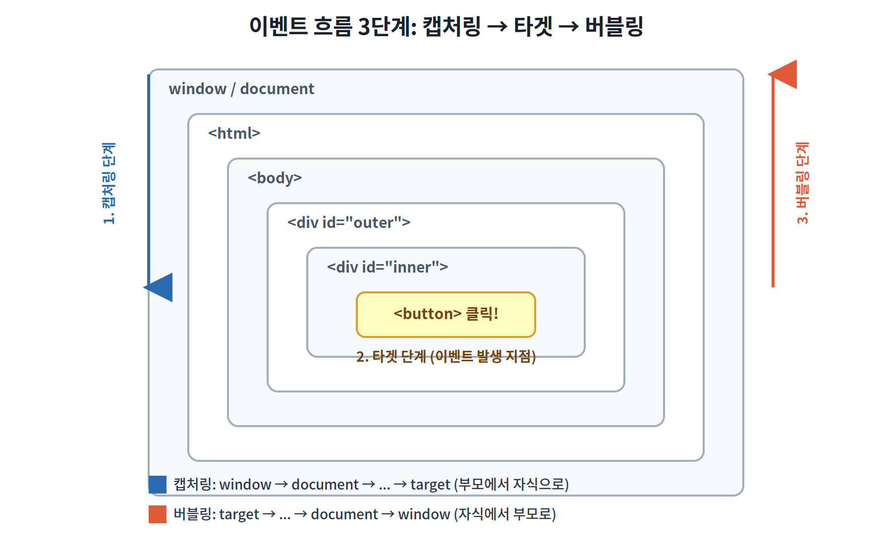

<div style="word-break: keep-all; overflow-wrap: break-word;" markdown="1">


## 1. 이벤트 버블링(Event Bubbling)이란

DOM에서 이벤트가 발생하면, 그 이벤트는 한 요소에서 끝나지 않고 **3단계**를 거쳐 전파된다. 오늘은 이 전체 흐름과 그중 하나인 "버블링"을 정리한다.



### 이벤트 전파 3단계

1. **캡처링(Capturing) 단계** — `window`에서 시작해서 실제 이벤트가 발생한 요소(target)까지 **부모 → 자식** 방향으로 내려감
2. **타겟(Target) 단계** — 이벤트가 실제로 발생한 요소에 도달한 시점
3. **버블링(Bubbling) 단계** — target에서 다시 `window`까지 **자식 → 부모** 방향으로 거슬러 올라감

우리가 평소에 `addEventListener`로 등록하는 리스너는 기본적으로 **버블링 단계**에서 동작한다. 즉, 자식 요소에서 발생한 이벤트가 부모 요소까지 계속 전파되면서, 부모에 걸어둔 리스너도 같이 실행된다는 뜻이다.

```html
<div id="outer">
  <div id="inner">
    <button id="btn">클릭</button>
  </div>
</div>
```

```javascript
document.getElementById('outer').addEventListener('click', () => {
  console.log('outer 클릭됨');
});
document.getElementById('inner').addEventListener('click', () => {
  console.log('inner 클릭됨');
});
document.getElementById('btn').addEventListener('click', () => {
  console.log('button 클릭됨');
});
```

`button`을 클릭하면 콘솔에는 다음 순서로 출력된다.

```
button 클릭됨
inner 클릭됨
outer 클릭됨
```

버블링이 target → 부모 방향으로 진행되기 때문에, 가장 안쪽 요소의 리스너부터 실행되고 바깥쪽으로 갈수록 나중에 실행된다.

---

## 2. 캡처링 단계에서 리스너를 등록하려면

`addEventListener`의 세 번째 인자로 `true`(또는 `{ capture: true }`)를 넘기면, 버블링이 아니라 캡처링 단계에서 이벤트를 받을 수 있다.

```javascript
document.getElementById('outer').addEventListener(
  'click',
  () => console.log('outer 캡처링'),
  true // capture: true
);
```

이 경우 위 예시와 같은 클릭이 일어나면 출력 순서가 반대로 뒤집힌다.

```
outer 캡처링
button 클릭됨
inner 클릭됨
outer 클릭됨
```

캡처링 단계는 실무에서 자주 쓰이진 않지만, 이벤트를 다른 리스너보다 먼저 가로채야 하는 특수한 상황(예: 전역 클릭 감지, 모달 바깥 클릭 감지)에서 유용하다.

---

## 3. `stopPropagation()` — 버블링 막기

부모로 이벤트가 전파되는 걸 막고 싶으면 `stopPropagation()`을 호출한다.

```javascript
document.getElementById('inner').addEventListener('click', (e) => {
  e.stopPropagation();
  console.log('inner에서 전파 중단');
});
```

이렇게 하면 `inner`까지만 이벤트가 실행되고, `outer`의 리스너는 실행되지 않는다.

> `stopPropagation()`과 `preventDefault()`는 역할이 다르다. `stopPropagation()`은 이벤트 전파를 막는 것이고, `preventDefault()`는 요소의 기본 동작(링크 이동, 폼 제출 등)을 막는 것이다. 둘은 필요에 따라 같이 쓰기도, 따로 쓰기도 한다.

---

## 4. 버블링을 활용한 이벤트 위임 (Event Delegation)

버블링의 가장 실용적인 활용법은 **이벤트 위임**이다. 자식 요소마다 각각 리스너를 다는 대신, 부모 하나에만 리스너를 걸고 `event.target`으로 실제 클릭된 자식을 판별하는 패턴이다.

```javascript
document.getElementById('list').addEventListener('click', (e) => {
  if (e.target.matches('li')) {
    console.log('클릭된 항목:', e.target.textContent);
  }
});
```

리스트 항목이 동적으로 추가/삭제되는 경우에도 부모에 리스너 하나만 걸려있으면 되기 때문에, 매번 새로 추가된 요소에 리스너를 다시 걸어줄 필요가 없다. 성능과 코드 관리 측면에서 실무에서 정말 많이 쓰는 패턴이다.

### TypeScript로 타입 안전하게 위임 처리하기

TS 환경에서는 `event.target`이 기본적으로 `EventTarget | null` 타입이라 바로 `matches`나 DOM 속성에 접근할 수 없다. 타입 가드를 거쳐야 한다.

```typescript
const list = document.getElementById('list');

list?.addEventListener('click', (e: MouseEvent) => {
  const target = e.target;

  if (target instanceof HTMLElement && target.matches('li')) {
    console.log('클릭된 항목:', target.textContent);
  }
});
```

`instanceof HTMLElement`로 타입을 좁혀준 다음에야 `matches`, `textContent` 같은 DOM 속성에 타입 에러 없이 접근할 수 있다. React 같은 프레임워크에서 합성 이벤트(`SyntheticEvent`)를 쓸 때도 `e.target`과 `e.currentTarget`의 타입 차이를 신경 써야 한다.

```typescript
function handleClick(e: React.MouseEvent<HTMLUListElement>) {
  const target = e.target as HTMLElement;
  if (target.tagName === 'LI') {
    console.log(target.textContent);
  }
}
```

---

## 5. 정리

- 이벤트는 **캡처링 → 타겟 → 버블링** 3단계로 전파된다.
- `addEventListener`의 기본 동작은 **버블링 단계**에서의 리스너 등록이다.
- `stopPropagation()`으로 전파를 막을 수 있지만, 이벤트 위임 패턴을 쓰는 부모 요소까지 막아버리면 의도치 않은 버그가 생기니 주의.
- **이벤트 위임**은 버블링을 활용해 부모 하나에만 리스너를 걸고 `e.target`으로 분기하는 패턴 — 동적으로 추가되는 요소에 특히 유용.
- TS에서는 `e.target`이 `EventTarget | null`이므로 `instanceof HTMLElement` 등으로 타입을 좁혀야 안전하게 속성에 접근 가능.

</div>
