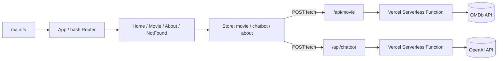

<div style="word-break: keep-all; overflow-wrap: break-word;" markdown="1">

React/Vue 같은 프레임워크 없이 TypeScript만으로 컴포넌트 렌더링·반응형 상태관리·라우팅을 직접 구현한 영화 검색 SPA입니다. OMDb API로 영화를 검색·조회하고, OpenAI 기반 챗봇이 대화로 취향에 맞는 영화를 추천해줍니다.

**배포**: [바로가기](https://omdb-movie-7xo0bcz1y-wonjuns-s-dev.vercel.app/#/) <br>
**레포지토리**: [바로가기](https://github.com/wonjun-s-dev/omdb-movie-app) <br>
**Stack**: TypeScript (Vanilla SPA), Parcel, Vercel Serverless Functions, OMDb API, OpenAI API <br>
**기간 / 인원**: 2026.07.14 ~ 2026.07.15 (2일) · 1인 개발 <br>

<div class="row">
    <div class="col-sm mt-3 mt-md-0">
        
    </div>
    <div class="col-sm mt-3 mt-md-0">
        
    </div>
    <div class="col-sm mt-3 mt-md-0">
        
    </div>
</div>
<div class="caption">
    왼쪽부터 영화 검색 결과 홈 화면, 영화 상세 페이지, OpenAI 기반 챗봇의 영화 추천 화면입니다.
</div>

## 프로젝트 소개

React/Vue 없이 상태가 바뀔 때 화면이 어떻게 다시 그려지는지를 직접 구현해보며 SPA의 동작 원리를 이해하기 위해 만든 2일짜리 사이드 프로젝트입니다.

- 프레임워크 없이 직접 구현한 `Component` / `Store` / `Router` 코어 위에서 동작하는 SPA
- OMDb API 연동 영화 검색, 무한 "더보기" 페이지네이션, 상세 페이지(스켈레톤 UI 포함)
- OpenAI 기반 AI 챗봇 — 답변 속 영화 제목을 파싱해 클릭 시 바로 검색으로 연결
- Vercel 서버리스 함수를 BFF로 두어 OMDb/OpenAI API 키를 클라이언트에 노출하지 않음

**왜 만들었는가**

평소 React로만 개발하다 보니 "상태가 바뀌면 화면이 왜/어떻게 다시 그려지는지"를 블랙박스로 여기고 있었습니다. 반응형 스토어와 라우터를 직접 만들어보면서, 프레임워크가 대신 해결해주던 문제를 스스로 풀어보고 싶어 시작했습니다.

**성과 / 결과**

2일 만에 커스텀 SPA 코어 + 영화 검색/상세 + AI 챗봇 + 반응형 레이아웃 + Vercel 배포까지 1인으로 완주했습니다. 배포 과정에서 발생한 TypeScript 버전 호환 이슈도 직접 원인을 분석해 해결했습니다 (아래 트러블슈팅 참고).

---

## 기술 스택

| 구분 | 기술 | 선택 이유 |
|---|---|---|
| Frontend | TypeScript (Vanilla, 커스텀 미니 SPA 코어) | 컴포넌트 렌더링·반응형 상태·라우팅을 직접 구현해 SPA 동작 원리를 체득하기 위해 |
| Bundler | Parcel | 별도 설정 없이 빠르게 TS를 번들링하고 dev 서버를 띄우기 위해 |
| Backend (BFF) | Vercel Serverless Functions | OMDb/OpenAI API 키를 클라이언트 번들에 노출하지 않기 위한 프록시 |
| 외부 API | OMDb API | 영화 검색 및 상세 정보 조회 |
| AI | OpenAI `gpt-3.5-turbo` | 사용자 취향 기반 대화형 영화 추천 챗봇 |
| Deploy | Vercel | 정적 프론트엔드 + 서버리스 함수를 한 번에 배포 |

이번 프로젝트에서 처음 써본 방식은 React/Vue 없이 만든 커스텀 SPA 코어(`src/core/core.ts`)입니다. `Component`(렌더 생명주기), `Object.defineProperty` getter/setter + pub-sub 기반 반응형 `Store`, 해시 기반 `Router`를 직접 설계·구현하면서, Vue2가 `Object.defineProperty` 방식의 한계로 `Proxy` 기반 반응성(Vue3)으로 옮겨간 이유를 코드로 체감할 수 있었습니다.

---

## 아키텍처



클라이언트는 항상 `/api/*` 상대 경로만 호출하고, 실제 외부 API 키는 서버리스 함수(`api/movie.ts`, `api/chatbot.ts`) 안 환경 변수에서만 사용해 프론트 번들에 시크릿이 섞이지 않도록 설계했습니다.

---

## 프로젝트 구조

```
omdb-movie-app/
├── api/
│   ├── movie.ts          # OMDb API 프록시 (Vercel Serverless Function)
│   └── chatbot.ts        # OpenAI API 프록시 (Vercel Serverless Function)
├── src/
│   ├── core/core.ts      # Component / Store / Router 코어
│   ├── components/       # Chatbot, Search, MovieList, MovieItem, TheHeader, TheFooter 등
│   ├── routes/            # Home, Movie, About, NotFound + 라우트 정의
│   ├── store/              # movie, chatbot, about 도메인 상태
│   ├── main.ts
│   └── main.css
├── index.html
└── vercel.json
```

---

## 주요 기능

**1. 영화 검색 & 더보기 페이지네이션**

`Search` 컴포넌트에서 입력한 제목으로 OMDb를 검색하고, `MovieList`/`MovieItem`이 결과를 그리드로 렌더링. `totalResults` 기반으로 `MovieListMore` 버튼을 조건부 노출.

**2. 영화 상세 페이지**

데이터 로딩 중 스켈레톤 UI를 먼저 그리고, 로드가 끝나면 포스터(`SX300` → `SX700` 치환으로 고화질 요청)와 평점·배우·감독 정보를 채움.

**3. AI 챗봇 영화 추천**

플로팅 챗 위젯에서 대화로 영화를 추천받고, 응답 속 영화 제목을 클릭하면 검색창에 자동 입력되어 즉시 검색까지 실행.

**4. 반응형 레이아웃**

1200px / 720px / 600px 브레이크포인트로 헤더, 영화 그리드, 상세 페이지, 챗봇 위젯 레이아웃을 조정.

---

## 트러블슈팅

**1. 프레임워크 없이 반응형 상태 관리 구현하기**

상태가 바뀔 때 관련 컴포넌트만 다시 그리는 구조가 필요했지만 별도 라이브러리는 쓰지 않기로 했습니다. `Store` 클래스에서 상태 객체의 각 key를 `Object.defineProperty`로 감싸 getter/setter를 만들고, setter 호출 시 `subscribe`로 등록된 콜백들을 실행하는 pub-sub 구조로 해결했습니다. `MovieList`, `Chatbot` 등은 생성자에서 관심 있는 key를 구독해 자신의 `render()`를 재호출합니다.

**2. LLM 응답에서 영화 제목만 안전하게 추출하기**

챗봇이 자연어로 영화를 추천하면 어떤 부분이 "영화 제목"인지 프론트에서 구분할 수 없었습니다. `api/chatbot.ts`의 system prompt에서 영화 제목을 항상 `{{한글제목//영어제목}}(연도)` 형식으로 감싸도록 강제하고, 이 포맷을 따르는 few-shot 예시 10개를 시스템 메시지에 미리 넣어 포맷 준수율을 높였습니다. 프론트에서는 `/{{(.*?)\/\/(.*?)}}/g` 정규식으로 이 포맷만 캡처해 클릭 가능한 `span`으로 치환합니다.

**3. Vercel 배포 시 TypeScript 버전 호환성 문제**

로컬에서는 문제없이 동작하던 프로젝트가 Vercel 배포 빌드에서만 실패했습니다. 원인은 `package.json`에 지정된 `typescript: "^7.0.2"`가 Vercel의 Node 빌드 환경에서 아직 지원되지 않는 버전이었기 때문입니다. TypeScript 7은 컴파일러가 네이티브(Go) 바이너리로 전환되면서 기존 JS 기반 Compiler API가 패키지에서 빠졌는데, Vercel 빌드 툴체인이 이 API를 호출하려다 `Cannot read properties of undefined (reading 'readFile')` 에러로 실패한 것입니다. `typescript`를 `5.9.3`으로 다운그레이드하고 `package-lock.json`을 재생성해 해결했고, 두 번의 커밋(`c737869`, `6b448af`)으로 배포를 정상화했습니다.

---

## 실행 방법

요구 사항: Node.js 18+, npm

```bash
git clone https://github.com/wonjun-s-dev/omdb-movie-app.git
cd omdb-movie-app
npm install

# .env 파일 생성 후 아래 값 입력
# OMDB_API_KEY=발급받은_OMDb_API_키
# OPENAI_API_KEY=발급받은_OpenAI_API_키

npm run dev       # parcel dev 서버 (프론트만)
# 서버리스 함수(/api)까지 함께 테스트하려면
npm run vercel     # vercel dev
```

> 빌드/개발 명령은 `vercel.json`에서 `npm run build` / `npm run dev`로 지정되어 있어, `main` 브랜치에 push하면 Vercel이 자동으로 빌드·배포합니다.

---

## 회고

**상태 관리 관점**

프레임워크 없이 SPA를 만들면서 React/Vue가 대신 해결해주던 "상태 변경 → DOM 리렌더링" 문제를 직접 풀어야 했습니다. `Store` 클래스는 상태 객체의 각 key를 `Object.defineProperty`로 감싸 getter/setter를 만들고, setter가 호출되는 시점에 `subscribe`로 등록된 콜백들을 순회 실행하는 pub-sub 구조로 구현했습니다. 이 방식을 직접 만들어보니 Vue2가 `push`, `splice` 같은 배열 변경을 감지하지 못했던 이유(배열의 모든 인덱스에 개별적으로 `defineProperty`를 걸 수는 없다는 한계)를 코드 레벨에서 이해할 수 있었고, Vue3가 왜 `Proxy` 기반 반응성으로 옮겨갔는지도 자연스럽게 체감했습니다. `MovieList`, `Chatbot` 같은 컴포넌트는 생성자에서 관심 있는 key만 구독해 자신의 `render()`만 재호출하도록 설계해, 전역 상태 하나가 바뀌어도 무관한 컴포넌트까지 다시 그려지지 않도록 했습니다.

**AI 연동 관점**

LLM을 실제 UI 로직에 연결할 때 가장 크게 배운 건, 자연어 응답을 그대로 신뢰하고 정규식으로 파싱하면 안 된다는 점이었습니다. 대신 시스템 프롬프트에서 영화 제목을 항상 `{{한글제목//영어제목}}(연도)` 형식으로 감싸도록 강제하고, 이 포맷을 지키는 few-shot 예시 10개(장르별 추천 응답)를 미리 넣어 포맷 준수율을 끌어올렸습니다. few-shot 예시를 늘릴수록 포맷을 벗어나는 응답 빈도가 눈에 띄게 줄어드는 걸 직접 확인했고, "모델의 자유도를 프롬프트로 얼마나 좁혀줄 것인가"가 기능 구현 자체보다 더 중요한 설계 포인트라는 걸 체감했습니다.

**아키텍처 관점**

OMDb/OpenAI API 키를 클라이언트 번들에 노출하지 않기 위해 Vercel 서버리스 함수를 BFF로 두고, 프론트는 `/api/movie`, `/api/chatbot` 같은 상대 경로만 호출하도록 분리했습니다. 이 구조를 실제로 짜보면서 "프론트엔드 책임"과 "백엔드(프록시) 책임"의 경계를 어디서 그어야 하는지, 개인 사이드 프로젝트라도 시크릿 관리를 소홀히 하면 안 된다는 감각을 다시 잡을 수 있었습니다.

**배포·디버깅 관점**

로컬에서는 멀쩡하던 프로젝트가 Vercel 배포에서만 실패하는 상황을 겪으면서, 배포 환경과 로컬 환경의 툴체인 버전 차이가 실제 빌드 실패로 이어질 수 있다는 걸 체감했습니다. 원인은 `package.json`의 `typescript: "^7.0.2"`였는데, TypeScript 7이 컴파일러를 네이티브(Go) 바이너리로 전환하며 기존 JS 기반 Compiler API를 제거한 게 Vercel 빌드 툴체인과 충돌한 것이었습니다. "에러 로그 확인 → 의심되는 패키지 버전 특정 → lockfile까지 함께 정리해서 재현·해결"하는 순서로 원인을 좁혀간 이 디버깅 과정 자체가 이번 프로젝트에서 가장 실무에 가까운 경험이었습니다.

**아쉬운 점**

렌더링을 매번 `innerHTML` 전체 교체 방식으로 처리해서(Virtual DOM 없음) 상태가 바뀔 때마다 컴포넌트가 통째로 다시 그려집니다. `Chatbot`처럼 입력 포커스나 스크롤 위치가 중요한 컴포넌트는 `render()` 이후 수동으로 `focus()`/`scrollTo()`를 다시 호출해 겨우 우회했는데, 근본적으로는 필요한 DOM 노드만 갱신하는 부분 업데이트(diffing) 구조가 필요합니다. 사용자가 입력한 채팅 텍스트와 OpenAI 응답도 이스케이프 없이 `innerHTML`로 그대로 삽입하고 있어, 개인 학습용 프로젝트라 영향은 제한적이지만 실 서비스였다면 XSS 관점에서 반드시 sanitize가 필요했던 부분을 기능 구현 속도를 우선하며 기술 부채로 남겼습니다. 테스트 코드가 전혀 없어 `Store`의 페이지네이션 계산 로직이나 라우터의 정규식 매칭 같은 핵심 로직을 회귀 없이 안전하게 바꾸기 어렵고, 검색 API 호출에도 디바운스나 캐싱이 없어 같은 검색어를 다시 조회해도 매번 새로 fetch합니다. 2일이라는 짧은 기간에 커스텀 프레임워크 설계 + 라우팅 + 스토어 + API 연동 + AI 챗봇 + 반응형까지 욕심을 내다 보니, 네트워크 실패 시 사용자 피드백(토스트 등)이나 에러 바운더리 같은 디테일은 충분히 다듬지 못했습니다.

**다음 계획**

- `innerHTML`로 꽂히는 사용자/외부 데이터(채팅 메시지, 영화 상세 필드)에 대한 이스케이프 유틸을 추가해 XSS 위험 제거
- `Store` 구독 로직과 라우터 경로 매칭 함수에 대한 유닛 테스트(Vitest) 추가
- 검색 결과를 페이지 단위로 캐싱하고, 검색 입력에 debounce 적용
- `Movie`/`Chatbot` 컴포넌트를 부분 렌더링(필요한 DOM 노드만 갱신)으로 리팩토링해 포커스/스크롤 유지 문제 근본적으로 해결
- 챗봇 응답을 OpenAI 스트리밍 API로 받아 타이핑 효과 제공

### 향후 개선 계획

- [ ] 채팅/상세 데이터 innerHTML 삽입부 XSS 이스케이프 처리
- [ ] Store·Router 핵심 로직 유닛 테스트 작성 (Vitest)
- [ ] 검색 결과 페이지 캐싱 + 입력 debounce
- [ ] Chatbot/Movie 컴포넌트 부분 렌더링(diffing)으로 리팩토링
- [ ] 챗봇 응답 스트리밍(타이핑 효과) 적용
- [ ] GitHub Actions로 배포 전 타입체크/린트 CI 추가

</div>
